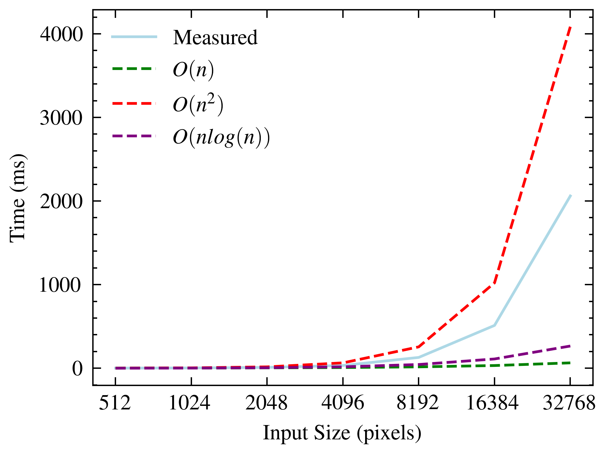

# Mandelbrot Generator


## Motivation
This repository was born after reading Mario Antoine Aoun's article about model collapse for generative models in the Communications of the ACM (CACM) [link]. Mario concludes the article by proposing a challenge for generative models to learn to depict images of the Mandelbrot set. The idea behind the challenge is that generative models will *never* be able to comprehend the complex dynamics of the Mandelbrot set. 

## Mandelbrot set

The Mandelbrot set [link] was investigated by numerous mathematicians but was first visualized by Benoit Mandelbrot [link]. The set is defined as the set of complex numbers $c$ for which the function $f_c(z) = z^2 + c$ remains bounded when iterated from $z=0$. Points in the complex plane are colored based on the speed of divergence when iterating the function. 

## Results

The hardware used for benchmarking was an NVIDIA GeForce GTX 1060 with 6GB of VRAM and an Intel(R) Core(TM) i7-4770K CPU @ 3.50GHz. 

The naive version implemented in C++ is significantly slower than the CUDA implementation (no surprise there). The following graph shows the time taken to generate images of increasing resolution for both implementations.





## Repository contents

```bash
📁 Mandelbrot-generator
├── 📁 bash
│   └── 📄 benchmark.sh
├── 📁 results
│   ├── 📄 graph.png
│   └── 📄 timings.csv
├── 📁 src
│   ├── 📁 mandelbrot-venv
│   ├── 🎛️ benchmark.cu
│   ├── 💻 common.cpp
│   ├── 📄 common.hpp
│   ├── 🐍 figures.py
│   ├── 💻 generate.cpp
│   ├── 🎛️ generate.cu
│   ├── 🎛️ kernel.cu
│   └── 🧩 kernel.cuh
└── 📘 README.md
```


